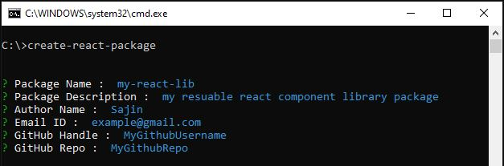
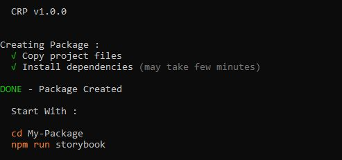
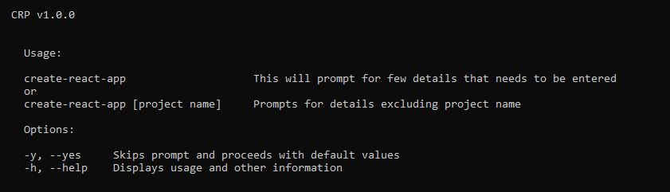

<br />

# react-quick-library


A simple and easy to use CLI to bootstrap reusable react component library or package.

<br />

- [x] Simple to use
- [x] Zero Config
- [x] Fast bundling & transpiling with rollup & babel
- [x] In-built storybook support

<br />

## Installation

<br />

```sh
npm i -g react-quick-library
```

<br />

## Basic Usage

<br />

```sh
#using npx:

npx react-quick-library
```

or

```sh
#after global installation

react-quick-library
```

#### The above command will prompt for below input options:

<br />

| options             | Description                                 |
| ------------------- | ------------------------------------------- |
| Package Name        | Name of the package/library                 |
| Package Description | Description for the package/library         |
| Author Name         | Name of the author ( of course its you 😆 ) |
| Email               | Email id of the author                      |
| GitHub Handle       | GitHubub account username                   |
| GitHub Repo         | GitHub Repository for this project          |

<br />
example:



<br />

> ## Options

<br />

`-y / --yes` :
You can skip the prompts and continue with the defaults by applying -y or --yes flag

```sh
react-quick-library -y

or

react-quick-library --yes
```

output :



<br />

`-h / --help` : Will display usage basic usage info

```sh
react-quick-library -h

or

react-quick-library --help
```

output :



<br />

Thats All, Happy Coding 🙂

<br />

# License

MIT &copy; [Sajin Soman](https://github.com/Fox333-Lab)
